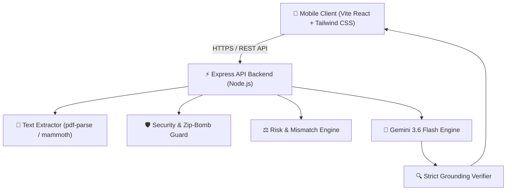

# ClauseClear — Overview & Architecture

ClauseClear is a **GenAI Legal Assistance & Access System** designed for first-time urban tenants in India. It provides plain-language document analysis, risk evaluation, missing clause detection, and interactive Q&A grounded strictly in the provided agreement text.

## Core System Architecture

## Quick Links

- [System Architecture](/architecture)
- [API Reference](/api)
- [Target Persona "Riya"](/DEMO)
- [Security Threat Model](/THREAT_MODEL)
- [Evaluation Suite Benchmark](/EVAL)
- [Deployment Presets](/deployment)
